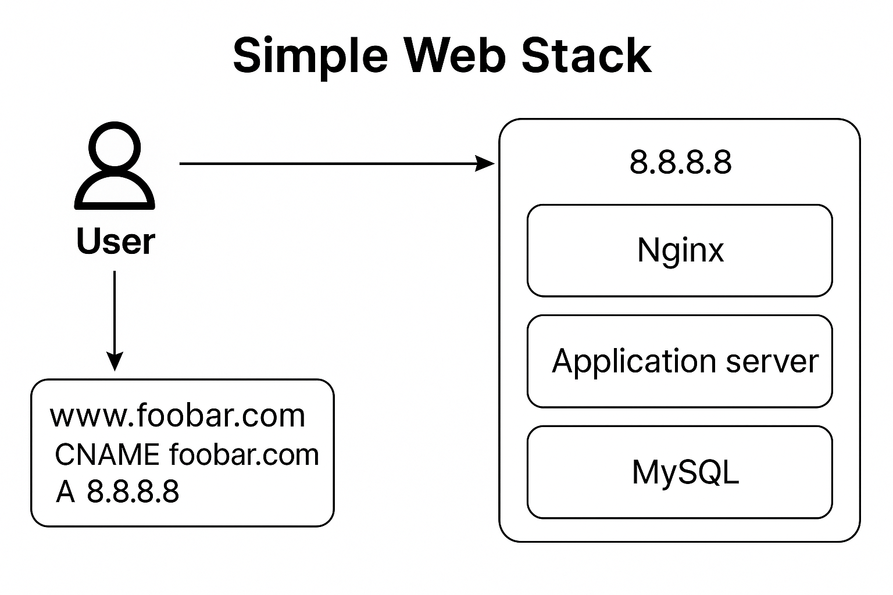

Explanation:

When a user types www.foobar.com into their browser:

The browser queries a DNS server to resolve the domain.

The DNS returns the IP address 8.8.8.8 (configured using a CNAME pointing to an A record).

The browser sends an HTTP request to the IP 8.8.8.8 on port 80.

The request arrives at the Nginx web server, which:

Serves static files directly.

Passes dynamic requests to the application server.

The application server (e.g., PHP interpreter) executes application logic and queries the MySQL database as needed.

The response is sent back through the web server to the user.

Infrastructure Components:

Server: A physical/virtual machine hosting the web application.

Domain name: foobar.com is a human-readable identifier translated by DNS to an IP address.

DNS record: www is a CNAME record pointing to foobar.com, which has an A record for 8.8.8.8.

Web server (Nginx): Handles HTTP requests and serves static content or forwards to app server.

Application server: Processes business logic (e.g., PHP, Python).

Database (MySQL): Stores persistent data for the application.

Communication protocol: Uses HTTP over TCP/IP.

Problems with this stack:

SPOF (Single Point of Failure): If the one server fails, the entire service is down.

No scalability: Cannot handle high traffic efficiently.

No high availability: Deployment or updates cause downtime.

