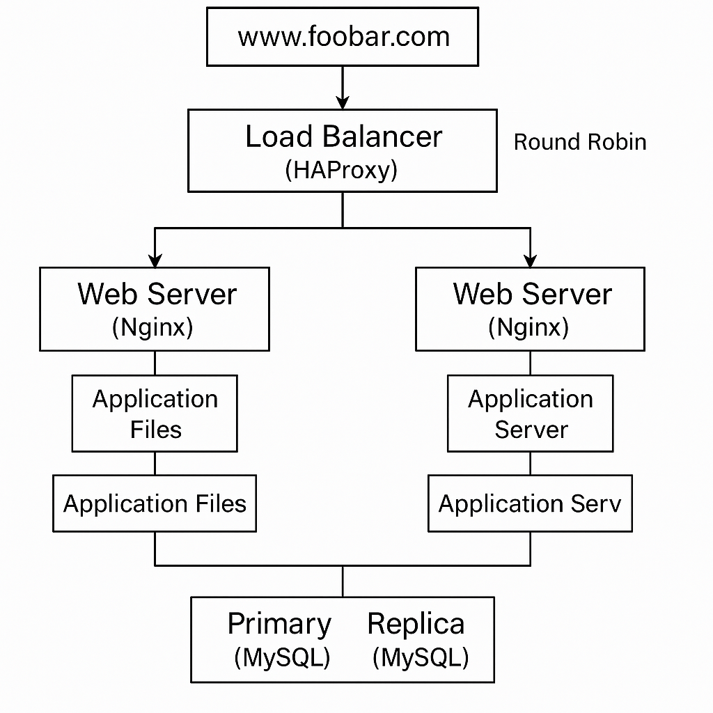

Components of the Infrastructure

1- Load Balancer (HAProxy)
- Purpose: Distributes incoming HTTP/HTTPS traffic between the two web servers to prevent overload and ensure high availability.
- Reason for adding: Without a load balancer, all traffic would hit a single server, which is a Single Point of Failure (SPOF) and a performance bottleneck.
- Load Balancing Algorithm: `Round Robin` – the load balancer distributes requests equally across available web servers in a circular order. This ensures balanced usage and prevents any one server from getting overwhelmed.

2- Two Web Servers
Each server includes:
- Web Server (Nginx): Handles static content (HTML, CSS, JS) and forwards dynamic requests to the application server.
- Application Server: Processes dynamic content using application logic (e.g., Python, PHP).
- Set of Application Files: The actual website codebase deployed on each application server.

- Reason for adding: Using two servers increases fault tolerance, allows for scaling, and improves response time by sharing the load.

3- Database Cluster (MySQL Primary-Replica)
- Primary (Master): Handles all write operations (INSERT, UPDATE, DELETE).
- Replica (Slave): Handles read operations only, replicates the primary data in real-time.

- Reason for adding: Distributing the read operations to the Replica reduces the load on the Primary and enhances performance and fault tolerance.

Load Balancer Configuration Type

- Active-Active setup: Both web servers are live and handle traffic at the same time. The load balancer sends traffic to both.
  
  Difference from Active-Passive:
  - Active-Active: Both nodes process traffic simultaneously.
  - Active-Passive: Only one node processes traffic while the other is on standby, ready to take over if the primary fails.

How the Primary-Replica Cluster Works

- The Primary node handles writes and updates.
- The Replica node continuously receives updates from the Primary using asynchronous replication.
- The application reads from both, but writes only to the Primary.
  
Advantages:
- Offloads read operations.
- Provides data redundancy.
- Allows for disaster recovery.

Issues with this Infrastructure

1- Single Points of Failure (SPOF)
- If the load balancer goes down, the entire site becomes unreachable.
- If the Primary database fails, write operations stop unless automated failover is implemented.

2- Security Concerns
- No HTTPS: Data between clients and the load balancer is not encrypted.
- No firewall: Servers are vulnerable to unauthorized access or DDoS attacks.

3- No Monitoring
- Without system monitoring tools (e.g., Prometheus, Nagios), we can't detect issues like high CPU, memory exhaustion, or service crashes in real time.

 Summary

This infrastructure improves performance, reliability, and scalability compared to a single-server stack, but it still needs:
- Redundancy for the load balancer.
- Firewall and HTTPS for secure communication.
- Monitoring for proactive issue detection.
